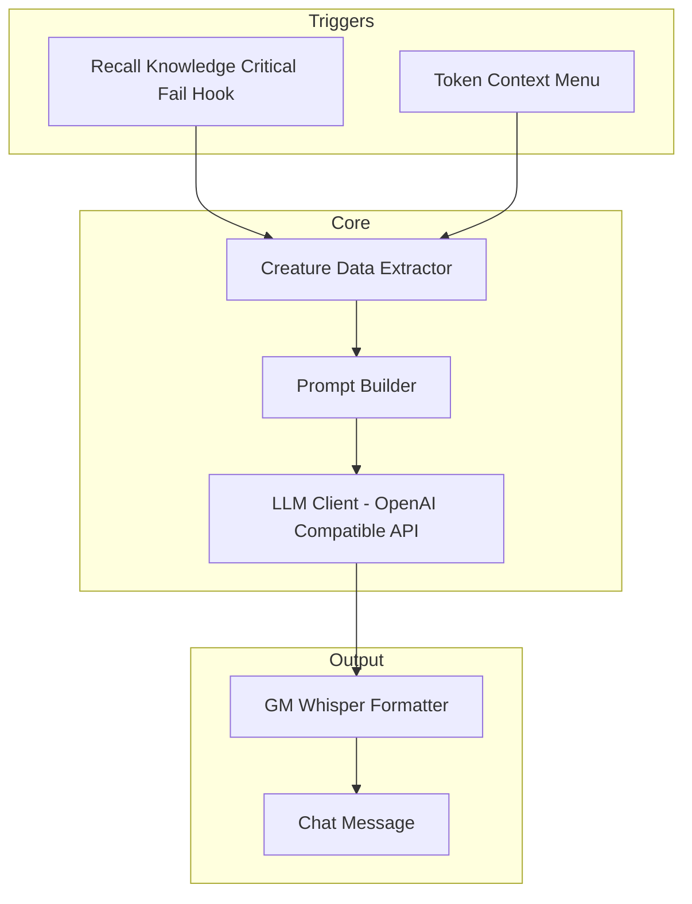
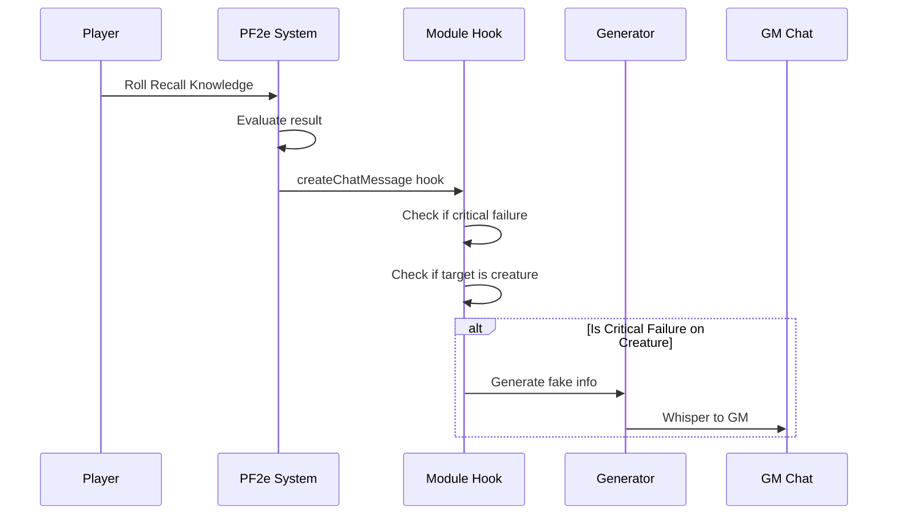

# PF2e Fake ID - Architecture Plan

## Overview

**Module Name:** pf2e-fake-id  
**Purpose:** Generate plausible but incorrect creature information for Pathfinder 2e in Foundry VTT, designed to support GM storytelling when players critically fail Recall Knowledge checks.

**Target Platform:**
- Foundry VTT v12+
- PF2e System (latest version)

## Core Features (MVP)

1. **Multi-LLM Support** - OpenAI API and Ollama (local LLMs)
2. **Dual Trigger System** - Automatic on critical fail + manual context menu
3. **GM Whisper Delivery** - Private messages to GM for review before sharing
4. **Customizable Prompts** - GM can modify prompt templates

## Future Features (Post-MVP)

- **Caching** - Store generated content to avoid redundant API calls
- **History Log** - Searchable record of generated misinformation
- Additional LLM providers (Claude, Google AI, etc.)
- Integration with PF2e's built-in Recall Knowledge UI
- Player-facing "unreliable narrator" mode
- Custom fake info templates per creature type
- Bulk generation for encounter prep

---

## System Architecture



---

## Directory Structure (MVP)

```
pf2e-fake-id/
├── module.json                 # Module manifest
├── scripts/
│   ├── module.js              # Main entry point
│   ├── settings.js            # Module settings registration
│   ├── hooks.js               # Foundry hooks registration
│   ├── llm-client.js          # Unified OpenAI-compatible API client
│   ├── creature/
│   │   ├── extractor.js       # Extract creature data from PF2e actors
│   │   └── formatter.js       # Format creature data for prompts
│   ├── generation/
│   │   ├── prompt-builder.js  # Build prompts from templates
│   │   └── generator.js       # Orchestrate fake info generation
│   ├── ui/
│   │   └── context-menu.js    # Token context menu integration
│   └── chat/
│       └── whisper.js         # GM whisper message handling
├── templates/
│   └── whisper-message.hbs    # Chat message template
├── styles/
│   └── module.css             # Module styles
├── lang/
│   └── en.json                # English localization
└── README.md                  # Documentation
```

---

## Component Details

### 1. LLM Client (Unified OpenAI-Compatible API)

Both OpenAI and Ollama support the OpenAI Chat Completions API format, so we use a single unified client. The GM simply configures the base URL and API key (if needed).

**Configuration Options:**

| Setting | Type | Description |
|---------|------|-------------|
| `apiEndpoint` | string | API base URL (e.g., https://api.openai.com/v1 or http://localhost:11434/v1) |
| `apiKey` | string | API key (optional for local Ollama) |
| `model` | string | Model name (e.g., gpt-4o-mini, llama3.2) |

**Example Configurations:**

| Provider | Endpoint | API Key | Model |
|----------|----------|---------|-------|
| OpenAI | https://api.openai.com/v1 | sk-xxx... | gpt-4o-mini |
| Ollama (local) | http://localhost:11434/v1 | (empty) | llama3.2 |
| OpenRouter | https://openrouter.ai/api/v1 | sk-or-xxx... | anthropic/claude-3-haiku |
| Local vLLM | http://localhost:8000/v1 | (empty) | meta-llama/Llama-3-8b |

---

### 2. Creature Data Extraction

Extract relevant data from PF2e creature actors for prompt context.

**Extracted Data Points:**
- Basic Info: name, level, traits, rarity
- Defenses: AC, saves, HP, immunities, resistances, weaknesses
- Offenses: attacks, damage types, special abilities
- Spells: innate and prepared spells
- Special Abilities: auras, reactions, passive abilities
- Lore: creature type, description, habitat

**Example Extracted Data:**
```javascript
{
  name: "Adult Red Dragon",
  level: 14,
  traits: ["dragon", "fire"],
  rarity: "common",
  defenses: {
    ac: 36,
    hp: 305,
    immunities: ["fire", "paralyzed", "sleep"],
    resistances: [],
    weaknesses: [{ type: "cold", value: 15 }]
  },
  offenses: {
    attacks: [
      { name: "Jaws", bonus: 28, damage: "3d12+15 piercing plus 3d6 fire" },
      { name: "Claw", bonus: 28, damage: "3d10+15 slashing" }
    ],
    breathWeapon: { type: "fire", damage: "16d6", dc: 36 }
  },
  // ... more data
}
```

---

### 3. Prompt Engineering

The prompt builder constructs context-aware prompts for generating believable misinformation.

**Default Prompt Template:**
```
You are a mischievous sage who enjoys spreading plausible but incorrect information about monsters. A adventurer has critically failed their attempt to recall knowledge about a creature.

CREATURE FACTS (DO NOT REVEAL THESE - USE THEM TO CREATE CONVINCING LIES):
Name: {{name}}
Level: {{level}}
Type: {{traits}}
Weaknesses: {{weaknesses}}
Resistances: {{resistances}}
Immunities: {{immunities}}
Notable Abilities: {{abilities}}

Generate 2-3 pieces of FALSE information that:
1. Sound believable and authoritative
2. Could lead to poor tactical decisions
3. Invert or twist the actual facts (e.g., if immune to fire, claim it's weak to fire)
4. Match the tone of Pathfinder 2e lore

Format your response as bullet points a GM could read aloud.
Do not include any meta-commentary or disclaimers.
```

**Customization Options:**
- GMs can edit the full prompt template
- Variable placeholders use Handlebars syntax
- Preset templates for different misinformation styles (tactical, lore, abilities)

---

### 4. Trigger System

#### Automatic Trigger (Recall Knowledge Critical Fail)

Hook into PF2e's skill check system:



**Detection Logic:**
1. Listen to `pf2e.check` hook or `createChatMessage` hook
2. Identify Recall Knowledge checks by action slug
3. Check for critical failure outcome
4. Identify the target creature from the check context

#### Manual Trigger (Context Menu)

Add option to token HUD or right-click context menu:

```javascript
// Token context menu entry
{
  name: "Generate Fake Recall Knowledge",
  icon: '<i class="fas fa-mask"></i>',
  condition: (token) => token.actor?.type === "npc" && game.user.isGM,
  callback: (token) => FakeIdGenerator.generate(token.actor)
}
```

---

### 5. GM Whisper Format

**Chat Message Structure:**
```handlebars
<div class="pf2e-fake-id-whisper">
  <header>
    <h3><i class="fas fa-mask"></i> Fake Recall Knowledge</h3>
    <span class="creature-name">{{creatureName}}</span>
  </header>
  
  <div class="fake-info">
    {{{generatedContent}}}
  </div>
  
  <footer>
    <button class="share-to-all">
      <i class="fas fa-bullhorn"></i> Share to All
    </button>
    <button class="regenerate">
      <i class="fas fa-sync"></i> Regenerate
    </button>
  </footer>
</div>
```

---

## Settings Configuration (MVP)

### Module Settings

| Setting | Scope | Type | Default | Description |
|---------|-------|------|---------|-------------|
| `apiEndpoint` | world | string | "https://api.openai.com/v1" | OpenAI-compatible API endpoint |
| `apiKey` | world | string | "" | API key (optional for local models) |
| `model` | world | string | "gpt-4o-mini" | Model name |
| `promptTemplate` | world | string | (default) | Customizable prompt |

---

## API Format

### Unified Chat Completions API

All providers use the same OpenAI-compatible format:

```javascript
// POST {apiEndpoint}/chat/completions
{
  model: "gpt-4o-mini",  // or "llama3.2", etc.
  messages: [
    { role: "system", content: "..." },
    { role: "user", content: prompt }
  ],
  temperature: 0.8,
  max_tokens: 500
}
```

**Response Format:**
```javascript
{
  choices: [
    {
      message: {
        content: "• The dragon is terrified of loud noises..."
      }
    }
  ]
}
```

---

## Error Handling

| Error Type | Handling |
|------------|----------|
| API Key Missing | Show notification with link to settings |
| API Rate Limit | Queue requests, show retry countdown |
| Network Error | Retry with exponential backoff, fallback message |
| Invalid Response | Log error, show generic fake info |
| Creature Not Found | Show error notification |

---

## Security Considerations

1. **API Key Storage**: Store API keys using Foundry's settings system with `scope: "world"` (GM-only access)
2. **Request Validation**: Validate all user inputs before sending to LLM
3. **Rate Limiting**: Implement client-side rate limiting to prevent API abuse
4. **No Sensitive Data**: Never include player personal information in prompts

---

## Implementation Order (MVP)

1. **Phase 1 - Foundation**
   - Module scaffolding and manifest
   - Settings registration

2. **Phase 2 - LLM Integration**
   - Unified OpenAI-compatible client

3. **Phase 3 - Core Features**
   - Creature data extraction
   - Prompt builder
   - Generation orchestration

4. **Phase 4 - Triggers & Output**
   - Manual context menu trigger
   - Automatic critical fail detection
   - GM whisper formatting
   - Localization
   - Documentation

---

## Dependencies

- **Foundry VTT v12+** - Core platform
- **PF2e System** - Game system dependency
- **No external npm packages** - Use native Foundry/browser APIs

---

## Testing Strategy

1. **Manual Testing Matrix:**
   - Various creature types (dragons, undead, humanoids, etc.)
   - Both LLM providers
   - Both trigger methods

2. **Edge Cases:**
   - Creatures with no weaknesses
   - Creatures with complex abilities
   - Very long creature descriptions
   - API timeout handling
