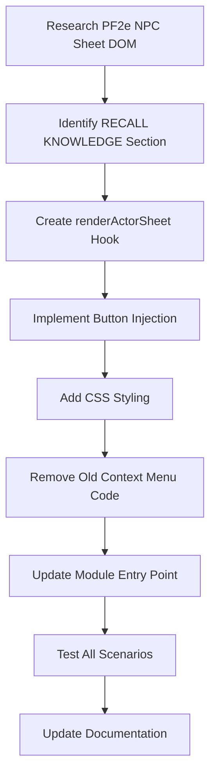

# Move Manual Fake Fact Button to Creature Sheet

## Overview

Refactor the module to move the "Generate Fake Recall Knowledge" button from its current locations (token HUD, token context menu, actor directory context menu) to the creature's NPC sheet in the RECALL KNOWLEDGE section header, next to the ATTEMPTS label.

## Current State

The button currently appears in three locations:
1. **Token HUD** - When selecting an NPC token on the canvas
2. **Token Context Menu** - When right-clicking an NPC token
3. **Actor Directory Context Menu** - When right-clicking an NPC in the Actors sidebar

All implemented in [`scripts/ui/context-menu.js`](../scripts/ui/context-menu.js:1)

## Target State

The button will appear in **one location only**:
- **NPC Sheet RECALL KNOWLEDGE Section** - In the header next to "ATTEMPTS"
- **GM-only visibility** - Maintained from current behavior
- **Removed from all previous locations** - Token HUD, context menus

## Technical Implementation

### 1. PF2e NPC Sheet Structure

The PF2e system uses custom sheet classes for NPCs. We need to:
- Hook into `renderActorSheet` (generic) or system-specific hooks
- Target only NPC-type actors (`actor.type === 'npc'`)
- Locate the RECALL KNOWLEDGE section in the rendered HTML
- Inject a button next to the ATTEMPTS header

**Key Hooks to Use:**
```javascript
Hooks.on('renderActorSheet', (sheet, html, data) => {
  // Filter for NPC sheets only
  if (sheet.actor.type !== 'npc') return;
  if (!game.user.isGM) return;
  
  // Inject button into RECALL KNOWLEDGE section
})
```

### 2. HTML Injection Strategy

**Target Selector Discovery:**
We need to inspect the PF2e NPC sheet HTML to find:
- The RECALL KNOWLEDGE section container
- The ATTEMPTS header element
- Where to insert the button (sibling, child, etc.)

**Possible Selectors (need verification):**
```css
/* Common PF2e patterns */
.sheet .tab[data-tab="main"] .recall-knowledge
.sheet .sidebar .recall-knowledge
.sheet .knowledge-section
h3:contains("RECALL KNOWLEDGE")
```

**Button Injection Approach:**
```javascript
// Find the RECALL KNOWLEDGE header
const recallHeader = html.find('.recall-knowledge-header');
// OR
const recallHeader = html.find('h3').filter(function() {
  return $(this).text().includes('RECALL KNOWLEDGE');
});

// Create button
const button = $(`
  <button class="pf2e-fake-id-sheet-button" 
          type="button" 
          title="${game.i18n.localize('PF2E_FAKE_ID.ContextMenu.GenerateFakeInfo')}">
    <i class="fas fa-mask"></i>
    <span>Generate Fake Info</span>
  </button>
`);

// Attach click handler
button.on('click', async (event) => {
  event.preventDefault();
  await onGenerateFakeInfo(sheet.actor);
});

// Insert into DOM
recallHeader.append(button);
// OR recallHeader.find('.attempts-label').after(button);
```

### 3. Visual Design

The button should match PF2e's visual language:

**Design Requirements:**
- Match PF2e's button styling (color scheme, fonts, sizing)
- Integrate seamlessly with RECALL KNOWLEDGE section design
- Use appropriate icon (currently `fa-mask`, may consider alternatives)
- Responsive sizing for different sheet sizes

**CSS Classes to Add:**
```css
/* Button on NPC Sheet */
.pf2e-fake-id-sheet-button {
  display: inline-flex;
  align-items: center;
  gap: 4px;
  padding: 4px 8px;
  margin-left: 8px;
  background: var(--pf2e-primary-color, #5e0000);
  color: white;
  border: 1px solid rgba(0, 0, 0, 0.3);
  border-radius: 3px;
  cursor: pointer;
  font-size: 0.85em;
  font-family: var(--font-primary);
  transition: all 0.2s ease;
}

.pf2e-fake-id-sheet-button:hover {
  background: var(--pf2e-primary-hover, #7a0000);
  box-shadow: 0 0 4px rgba(0, 0, 0, 0.3);
}

.pf2e-fake-id-sheet-button i {
  font-size: 1em;
}
```

### 4. File Changes Required

#### A. Rename and Refactor `scripts/ui/context-menu.js`

**New filename:** `scripts/ui/sheet-button.js`

**Changes:**
1. Remove all token HUD code (lines 128-151)
2. Remove token context menu code (lines 105-123)
3. Remove actor directory context menu code (lines 43-64)
4. Remove unused hooks and functions
5. Add new `renderActorSheet` hook
6. Rename export from `registerContextMenu()` to `registerSheetButton()`

**New structure:**
```javascript
/**
 * PF2e Fake ID - Sheet Button Integration
 * 
 * Adds button to NPC sheets for manual fake info generation.
 */

import { MODULE_ID } from '../settings.js';
import { generateFakeInfo } from '../generation/generator.js';

/**
 * Register the NPC sheet button
 */
export function registerSheetButton() {
  Hooks.on('renderActorSheet', onRenderActorSheet);
  console.log(`${MODULE_ID} | Sheet button registered`);
}

/**
 * Add button to NPC sheet RECALL KNOWLEDGE section
 */
function onRenderActorSheet(sheet, html, data) {
  // Implementation here
}

/**
 * Handler for generating fake info (reuse existing)
 */
async function onGenerateFakeInfo(actor) {
  // Keep existing implementation
}
```

#### B. Update `scripts/module.js`

Change import and function call:
```javascript
// OLD:
import { registerContextMenu } from './ui/context-menu.js';
registerContextMenu();

// NEW:
import { registerSheetButton } from './ui/sheet-button.js';
registerSheetButton();
```

#### C. Update `styles/module.css`

**Remove:**
- `.pf2e-fake-id-hud` styles (no longer needed for token HUD)

**Add:**
- `.pf2e-fake-id-sheet-button` styles (new sheet button)

#### D. Update `lang/en.json` (if needed)

Current text should work fine, but may want to add:
```json
"SheetButton": {
  "Title": "Generate Fake Recall Knowledge",
  "Label": "Fake Info"
}
```

### 5. Technical Challenges & Solutions

#### Challenge 1: Finding the RECALL KNOWLEDGE Section

**Problem:** PF2e sheet structure may vary between versions or sheet types.

**Solution:**
- Use multiple selector fallbacks
- Log warnings if section not found
- Gracefully fail without breaking sheet rendering

```javascript
function findRecallKnowledgeSection(html) {
  // Try multiple selectors
  let section = html.find('.recall-knowledge-header');
  if (!section.length) {
    section = html.find('h3').filter((i, el) => 
      $(el).text().includes('RECALL KNOWLEDGE')
    );
  }
  if (!section.length) {
    console.warn(`${MODULE_ID} | Could not find RECALL KNOWLEDGE section`);
    return null;
  }
  return section;
}
```

#### Challenge 2: Button Positioning

**Problem:** May need to position next to specific elements in the header.

**Solution:**
- Use flexbox-friendly insertion
- Ensure button doesn't break layout
- Test with different screen sizes

#### Challenge 3: Sheet Re-rendering

**Problem:** Sheet may re-render, causing button to disappear or duplicate.

**Solution:**
- Remove existing button before injecting new one
- Use unique class/ID for easy identification

```javascript
// Remove any existing button first
html.find('.pf2e-fake-id-sheet-button').remove();
// Then add new button
```

### 6. Testing Checklist

- [ ] Button appears in RECALL KNOWLEDGE section header on NPC sheets
- [ ] Button is positioned correctly next to ATTEMPTS
- [ ] Button only visible to GM users
- [ ] Button does NOT appear for players (even if they can view NPC sheet)
- [ ] Button does NOT appear on PC character sheets
- [ ] Button does NOT appear on token HUD anymore
- [ ] Token right-click menu does NOT show old option anymore
- [ ] Actor directory right-click does NOT show old option anymore
- [ ] Clicking button successfully generates fake information
- [ ] Button styling matches PF2e visual design
- [ ] Sheet can still be scrolled/resized without layout issues
- [ ] No console errors when opening/closing NPC sheets
- [ ] Works with both owned and unowned NPC actors

## Implementation Sequence



## Risk Assessment

| Risk | Severity | Mitigation |
|------|----------|------------|
| PF2e sheet structure changes in future | Medium | Use flexible selectors, version checks |
| Button breaks sheet layout | Low | Defensive CSS, test multiple resolutions |
| Performance impact on sheet render | Very Low | Minimal DOM manipulation |
| Conflicts with other modules | Low | Use unique class names, namespace CSS |

## Rollback Plan

If issues arise:
1. Keep old `context-menu.js` file as `context-menu.js.backup`
2. Git commit before changes
3. Can revert to old behavior by restoring imports in `module.js`

## Future Enhancements

After this refactoring:
- Consider adding to Bestiary browser as well
- Keyboard shortcut for quick generation
- Right-click on creature name in sheet for quick actions
- Integrate with PF2e's native Recall Knowledge UI when clicked

## Notes

- This change improves discoverability (button always visible on sheet vs. hidden in context menus)
- Reduces clutter in token HUD and context menus
- More intuitive workflow: "I'm viewing this creature, let me generate fake info"
- GM workflow: Open NPC sheet → Click button → Review whisper → Share to players
