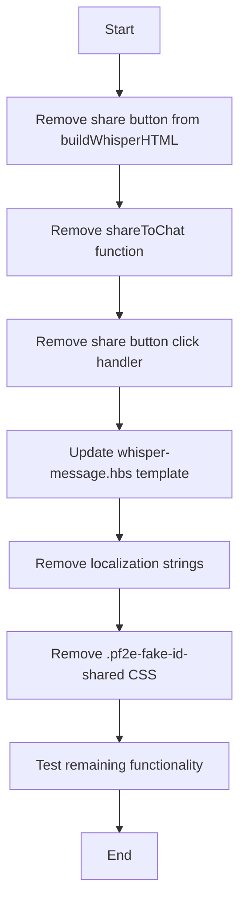

# Remove Share Feature Plan

## Overview
Remove the "Share to All" functionality that allows GMs to share generated fake facts to chat (visible to players).

## Current Implementation

The share feature consists of several components:

1. **UI Button** - "Share to All" button in the whisper message footer
2. **Share Function** - [`shareToChat()`](../scripts/chat/whisper.js:155) function that creates public chat messages
3. **Event Handler** - Click handler for the share button in [`registerWhisperButtonHandlers()`](../scripts/chat/whisper.js:182)
4. **Template Reference** - Button markup in [`whisper-message.hbs`](../templates/whisper-message.hbs:38)
5. **Localization Strings** - Translation keys in [`lang/en.json`](../lang/en.json:38)
6. **CSS Styles** - Styles for shared messages (`.pf2e-fake-id-shared`)

## Components to Remove

### 1. JavaScript Code (`scripts/chat/whisper.js`)

**Line 134-136**: Remove "Share to All" button from HTML template
```javascript
<button class="share-to-all" ${isLoading || isError ? 'disabled' : ''}>
  <i class="fas fa-bullhorn"></i> ${game.i18n.localize('PF2E_FAKE_ID.Chat.Buttons.ShareToAll')}
</button>
```

**Line 149-177**: Remove entire `shareToChat()` function
- This function creates public chat messages with fake information
- No longer needed once share button is removed

**Line 203-206**: Remove share button click handler
```javascript
if (button.classList.contains('share-to-all')) {
  if (fakeContent) {
    await shareToChat(fakeContent, creatureName, []);
  }
}
```

### 2. Template File (`templates/whisper-message.hbs`)

**Line 38-40**: Remove share button markup
```handlebars
<button class="share-to-all" {{#if isLoading}}disabled{{/if}} {{#if isError}}disabled{{/if}}>
  <i class="fas fa-bullhorn"></i> {{localize "PF2E_FAKE_ID.Chat.Buttons.ShareToAll"}}
</button>
```

### 3. Localization (`lang/en.json`)

**Line 38**: Remove ShareToAll translation key
```json
"ShareToAll": "Share to All",
```

**Line 58**: Remove Shared notification
```json
"Shared": "Fake information shared to chat.",
```

### 4. CSS Styles (`styles/module.css`)

**Lines 259-402**: Remove all `.pf2e-fake-id-shared` styles
- These styles are only used for messages shared to players
- No longer needed once share functionality is removed

## Impact Analysis

### What Remains
- ✅ Generate fake facts button on NPC sheets
- ✅ GM whisper messages with generated content
- ✅ Copy to clipboard functionality
- ✅ Regenerate functionality
- ✅ All generation and LLM integration logic

### What Gets Removed
- ❌ "Share to All" button
- ❌ Ability to broadcast fake facts to chat
- ❌ Public chat message styling for shared content
- ❌ Related event handlers and functions

### User Workflow After Removal

**Before:**
1. GM clicks "Fake Fact" button on NPC sheet
2. Fake information generated and shown in private whisper
3. GM can either:
   - Share to all players via "Share to All" button ❌ REMOVED
   - Copy to clipboard and paste manually ✅ KEPT
   - Regenerate if not satisfied ✅ KEPT

**After:**
1. GM clicks "Fake Fact" button on NPC sheet
2. Fake information generated and shown in private whisper
3. GM can either:
   - Copy to clipboard and paste manually (if sharing is desired)
   - Regenerate if not satisfied

## Implementation Steps



## Files to Modify

| File | Changes | Lines Affected |
|------|---------|----------------|
| [`scripts/chat/whisper.js`](../scripts/chat/whisper.js) | Remove share button, function, and handler | 134-136, 149-177, 203-206 |
| [`templates/whisper-message.hbs`](../templates/whisper-message.hbs) | Remove share button markup | 38-40 |
| [`lang/en.json`](../lang/en.json) | Remove ShareToAll and Shared keys | 38, 58 |
| [`styles/module.css`](../styles/module.css) | Remove .pf2e-fake-id-shared styles | 259-402 |

## Testing Checklist

After implementation, verify:
- [ ] Fake fact generation still works
- [ ] GM whisper messages display correctly
- [ ] Copy to clipboard still works
- [ ] Regenerate still works
- [ ] No console errors
- [ ] No broken references to removed functions
- [ ] Footer buttons layout looks correct with one less button

## Notes

- The copy to clipboard feature remains as an alternative for GMs who want to share content
- This simplifies the module by reducing features and potential points of failure
- GMs can still manually share content by copying and pasting into chat
